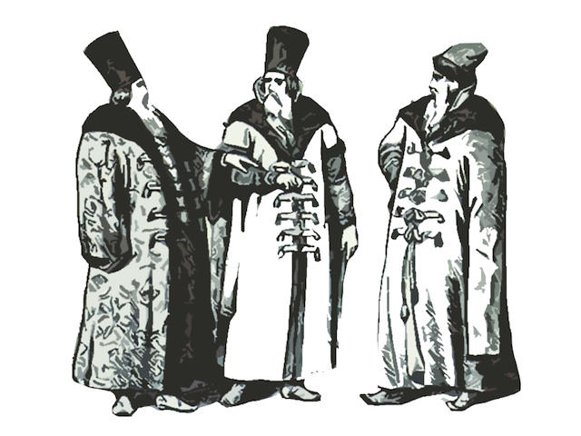

# Boyar + Strelets

Management layer that provisions virtual chains for [ORBS blockchain](https://github.com/orbs-network/orbs-network-go/).

Works together with [Nebula](https://github.com/orbs-network/nebula).

## Tips

To remove all containers: `docker rm -f $(docker ps -aq)`

## Testing

`./build-binaries.sh && ./test.e2e.sh`
